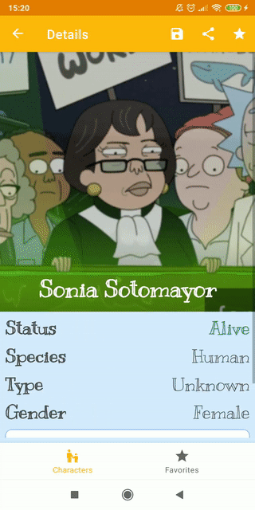
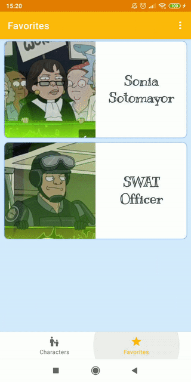

# MoRick - Rick and Morty Android Pet Project
### Single Activity Android app to list characters, show details screen and locations screen with info and characters, add/remove favorites, share
#### In development: save image

#### The app uses:
 - Kotlin
 - MVVM
 - DI with Dagger - Hilt
 - Navigation
 - Safe Args
 - Retrofit
 - Coroutines 
 - Room database
 - Coil Image loading library
 - ViewPager2
 - Data binding
 - View binding
 - DataStore

##### Preview of NetworkListener and list:

##### Preview of search and endless scrolling:

##### Preview of details and locations screen with ViewPager2:

#### Preview of adding/removing favorites on details screen

#### Preview of remove/undo/delete all favorites on favorites screen

